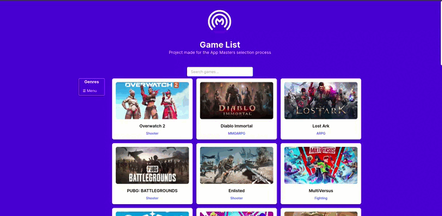
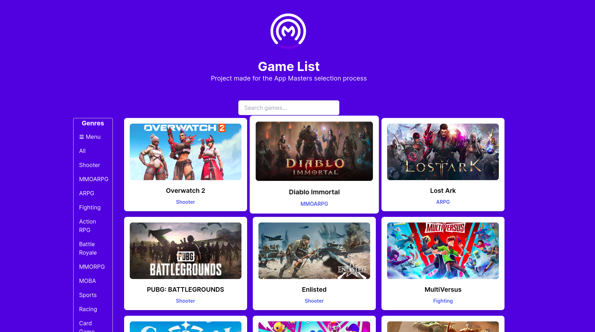
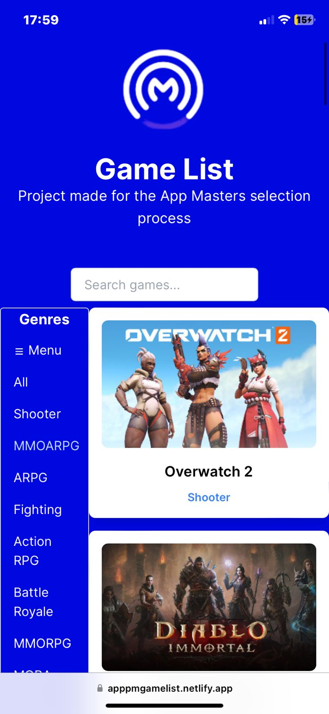

# Projeto de Lista de Jogos

Este projeto foi desenvolvido como parte do processo seletivo da App Masters. É uma lista de jogos que permite filtrar os jogos por gênero. O objetivo do projeto é demonstrar habilidades em desenvolvimento web utilizando tecnologias como React.

## Site

Clique [aqui](https://apppmgamelist.netlify.app/) para acessar o site!

## Funcionalidades do Projeto

-Carrega e exibe uma lista de jogos a partir da API fornecida.

-Apresenta um indicador de carregamento enquanto os dados são obtidos.

-Organiza os jogos em três colunas para uma melhor visualização (no computador).

-Cada card exibe o título e a imagem do jogo.

-Adapta-se de forma responsiva para diferentes dispositivos, incluindo computadores, tablets e celulares.

-Trata erros específicos retornados pela API:

-Quando a API retorna um status code 500, 502, 503, 504, 507, 508 ou 509, exibe a mensagem "O servidor falhou em responder, tente recarregar a página".
-Para outros erros da API, exibe a mensagem "O servidor não conseguiu responder por agora, tente voltar novamente mais tarde".
-Define um limite de tempo de 5 segundos para a resposta da API. Se os dados demorarem mais do que isso para retornar, exibe a mensagem "O servidor demorou para responder, tente mais tarde".

-Oculta o indicador de carregamento assim que os dados são apresentados ou quando ocorre um erro.

-Inclui um campo de busca para filtrar os jogos por título, realizando uma busca insensível a maiúsculas e minúsculas.

-Permite ao usuário selecionar um gênero entre os disponíveis nos dados retornados pela API.

-Filtra os jogos com base no gênero selecionado, exibindo apenas os jogos correspondentes.

## Tecnologias utilizadas

Next.js: framework React com funcionalidades adicionais para desenvolvimento web

Tailwind CSS: biblioteca de estilos utilitários para criação de interfaces responsivas

React: biblioteca JavaScript para construção de interfaces de usuário

## Fotos

Aqui estão algumas capturas de tela do projeto:

## Contribuição

Contribuições são bem-vindas! Se você tiver sugestões, melhorias ou correções, sinta-se à vontade para criar uma _issue_ ou enviar um _pull request_.
